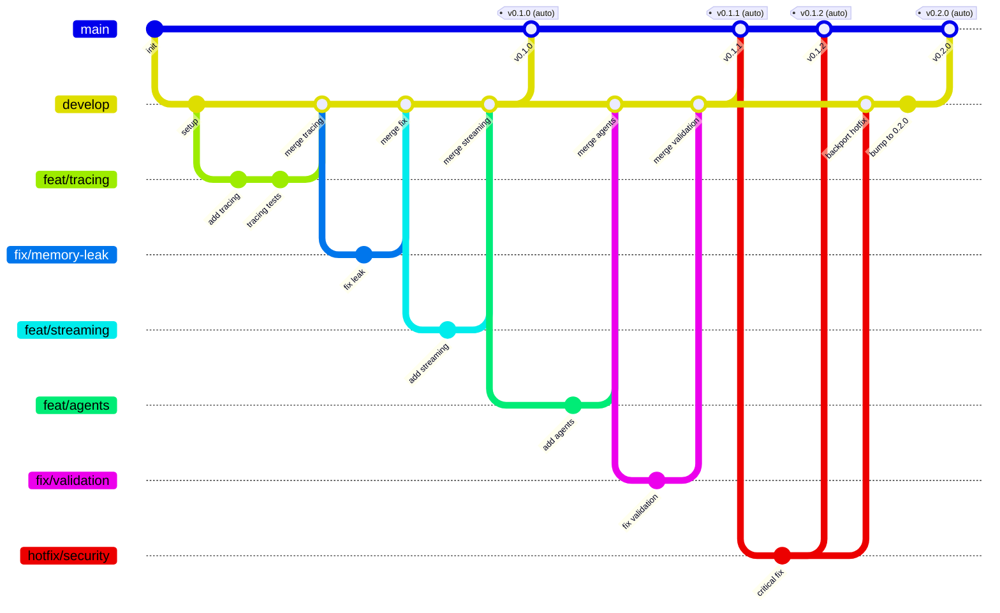

# unified-ui SDK

[](https://github.com/unified-ui/unifiedui-sdk/actions/workflows/ci-tests-and-lint.yml)
[](https://www.python.org/downloads/)
[](LICENSE)
[](https://docs.astral.sh/ruff/)

> **Python SDK for external integration with the unified-ui platform** — tracing, streaming, agents, and more!

## What is unified-ui?

**unified-ui** transforms the complexity of managing multiple AI systems into a single, cohesive experience. Organizations deploy agents across diverse platforms — Microsoft Foundry, n8n, LangGraph, Copilot, and custom solutions — resulting in fragmented user experiences, inconsistent monitoring, and operational silos!

unified-ui eliminates these challenges by providing **one interface where every agent converges**.

## What is this SDK?

The **unified-ui SDK** is a complementary Python package that provides capabilities for **external integration** with the unified-ui platform:

| Module | Description |
|--------|-------------|
| 🔍 **Tracing** | Standardized tracing objects; LangChain & LangGraph trace sniffing and forwarding |
| 📡 **Streaming** | Standardized streaming response protocol for unified-ui |
| 🤖 **Agents** | ReACT Agent class with an agent engine built on LangChain / LangGraph |
| � **Integrations** | LangChain & LangGraph stream adapters + REST API contract models for building external agents |
| �🔧 **Tools** | Reusable tool clients (Microsoft 365 Graph API) for building AI agents |
| 🧱 **Core** | Shared interfaces, base classes, and utility functions |

### How It Fits

```
┌─────────────┐     ┌──────────────────────────────────────────────┐
│  Frontend   │────▶│         Platform Service (FastAPI)           │
└─────────────┘     │  • Authentication & RBAC                     │
                    │  • Tenants, Applications, Credentials        │
                    │  • Conversations, Autonomous Agents          │
                    └──────────────────┬───────────────────────────┘
                                       │
              ┌────────────────────────┼────────────────────────┐
              ▼                        ▼                        ▼
     ┌────────────────┐    ┌────────────────┐    ┌────────────────┐
     │ Agent Service  │    │ Custom Service │    │ External App   │
     │  (Go/Gin)      │    │                │    │                │
     └────────────────┘    └────────────────┘    └────────────────┘
              │                    │                      │
              │         ┌─────────┴──────────┐           │
              │         │  unifiedui-sdk ◀───┼───────────┘
              │         │  (this package)    │
              │         └────────────────────┘
              ▼
     ┌────────────────┐
     │ AI Backends    │
     │ N8N, Foundry,  │
     │ LangGraph, ... │
     └────────────────┘
```

---

## Installation

```bash
pip install unifiedui-sdk
```

Or with [uv](https://docs.astral.sh/uv/):

```bash
uv add unifiedui-sdk
```

---

## Quick Start

### Tracing — Capture Traces from LangChain / LangGraph

```python
from unifiedui_sdk.tracing import UnifiedUILanggraphTracer

tracer = UnifiedUILanggraphTracer()

# Attach to any LangChain/LangGraph execution
result = graph.invoke(
    {"messages": [("human", "Hello")]},
    config={"callbacks": [tracer]},
)

# Get the trace as a dict (camelCase JSON for the agent-service API)
trace_dict = tracer.get_trace_dict()
```

### Streaming — Build SSE Responses

```python
from unifiedui_sdk.streaming import StreamWriter, StreamMessageType

writer = StreamWriter()

# Build stream messages for the unified-ui SSE protocol
yield writer.stream_start()
yield writer.text_stream("Hello ")
yield writer.text_stream("world!")
yield writer.tool_call_start("tc_1", "search", {"query": "test"})
yield writer.tool_call_end("tc_1", "search", "success", tool_result="Found 3 results")
yield writer.stream_end()
```

### Agents — Single-Agent with Tools

```python
from langchain_openai import ChatOpenAI
from langchain_core.tools import tool

from unifiedui_sdk.agents import ReActAgentConfig, ReActAgentEngine
from unifiedui_sdk.tracing import ReActAgentTracer


@tool
def calculator(expression: str) -> str:
    """Evaluate a math expression."""
    return str(eval(expression))


llm = ChatOpenAI(model="gpt-4o-mini", temperature=0.1)
config = ReActAgentConfig(system_prompt="You are a helpful assistant.")
tracer = ReActAgentTracer()

engine = ReActAgentEngine(
    config=config, llm=llm, tools=[calculator], tracer=tracer
)

# Stream agent execution
async for msg in engine.invoke_stream("What is 42 * 17?"):
    if msg.type == "TEXT_STREAM":
        print(msg.content, end="", flush=True)
    elif msg.type == "TOOL_CALL_START":
        print(f"\nTool: {msg.config['tool_name']}")
    elif msg.type == "TOOL_CALL_END":
        print(f"Result: {msg.config['tool_result']}")
```

### Agents — Multi-Agent Orchestration

```python
from unifiedui_sdk.agents import ReActAgentConfig, ReActAgentEngine
from unifiedui_sdk.agents.config import MultiAgentConfig
from unifiedui_sdk.tracing import ReActAgentTracer

config = ReActAgentConfig(
    system_prompt="You are a research assistant.",
    multi_agent_enabled=True,
    multi_agent=MultiAgentConfig(
        max_sub_agents=5,
        max_parallel_per_step=3,
    ),
)

tracer = ReActAgentTracer()
engine = ReActAgentEngine(config=config, llm=llm, tools=[...], tracer=tracer)

async for msg in engine.invoke_stream("Compare weather in Berlin, Munich, Hamburg"):
    if msg.type == "PLAN_COMPLETE":
        print("Plan:", msg.config["plan"]["goal"])
    elif msg.type == "SUB_AGENT_STREAM":
        print(msg.content, end="")
    elif msg.type == "SYNTHESIS_STREAM":
        print(msg.content, end="")

# Get the full trace
trace = tracer.get_trace()
```

### Agents — Tool Loading (OpenAPI + MCP)

```python
from unifiedui_sdk.agents.config import ToolConfig, ToolType, MCPTransport
from unifiedui_sdk.agents.tools.loader import load_tools

tool_configs = [
    ToolConfig(
        name="PetStore",
        type=ToolType.OPENAPI_DEFINITION,
        config={
            "spec_url": "https://petstore3.swagger.io/api/v3/openapi.json",
            "base_url": "https://petstore3.swagger.io/api/v3",
        },
    ),
    ToolConfig(
        name="MCP Weather",
        type=ToolType.MCP_SERVER,
        config={
            "url": "http://localhost:8080/sse",
            "transport": MCPTransport.SSE,
        },
    ),
]

tools = await load_tools(tool_configs)
engine = ReActAgentEngine(config=config, llm=llm, tools=tools)
```

### Tools — Microsoft 365 Clients

```python
pip install unifiedui-sdk[m365]
```

```python
from unifiedui_sdk.tools.m365 import (
    OutlookAPIClient,
    OutlookAuthProvider,
    OutlookCapability,
    SendMessage,
)

auth = OutlookAuthProvider(
    tenant_id="your-tenant-id",
    client_id="your-client-id",
    client_secret="your-client-secret",
)

client = OutlookAPIClient(
    auth_provider=auth,
    capabilities=[OutlookCapability.MAIL_READ, OutlookCapability.MAIL_SEND],
)

# Send email
client.messages.send(
    user_id="me",
    message=SendMessage(
        to=["recipient@example.com"],
        subject="Hello",
        body="<p>Message from unified-ui agent</p>",
    ),
)
```

> Detailed module documentation: [`tracing/`](src/unifiedui_sdk/tracing/README.md) · [`streaming/`](src/unifiedui_sdk/streaming/README.md) · [`agents/`](src/unifiedui_sdk/agents/README.md) · [`integrations/`](src/unifiedui_sdk/integrations/README.md) · [`tools/`](src/unifiedui_sdk/tools/README.md) · [`core/`](src/unifiedui_sdk/core/README.md)

### Integrations — Build REST API Agents for unified-ui

The **integrations** module provides everything you need to build a REST API agent service
that integrates with unified-ui. It includes stream adapters for LangChain and LangGraph,
plus Pydantic request/response models that define the contract between your agent and the platform.

#### Stream Adapters

Wrap your existing LangChain or LangGraph agents to stream responses in the unified-ui SSE protocol.
Both adapters follow the same pattern: **build your agent, pass it to the adapter, stream it.**

```python
from langchain_openai import AzureChatOpenAI
from langchain_core.tools import tool
from langgraph.prebuilt import create_react_agent

from unifiedui_sdk.integrations.langchain import LangchainStreamAdapter


@tool
def get_weather(city: str) -> str:
    """Get the weather for a city."""
    return f"{city}: 18°C, sunny"


llm = AzureChatOpenAI(
    azure_endpoint="https://your-resource.openai.azure.com/",
    api_key="your-key",
    azure_deployment="gpt-4.1",
    api_version="2024-05-01-preview",
)

# Build your agent however you want
agent = create_react_agent(llm, [get_weather])

# Wrap it with the adapter — that's it
adapter = LangchainStreamAdapter(agent=agent)

# Use in a FastAPI SSE endpoint
async for msg in adapter.stream("What is the weather in Berlin?"):
    yield {"event": msg.type.value, "data": msg.model_dump_json()}
```

`LanggraphStreamAdapter` works the same way, but additionally filters internal LangGraph nodes (`__start__`, `__end__`):

```python
from unifiedui_sdk.integrations.langgraph import LanggraphStreamAdapter

graph = create_react_agent(llm, [get_weather])
adapter = LanggraphStreamAdapter(graph=graph)

async for msg in adapter.stream("What is the weather in Berlin?"):
    yield {"event": msg.type.value, "data": msg.model_dump_json()}
```

Both adapters inherit from `BaseStreamAdapter`, which provides the shared `astream_events` → `StreamMessage` mapping logic.

#### REST API Contract Models

Use the standard Pydantic models so unified-ui's Agent Service can call your endpoints:

```python
from unifiedui_sdk.integrations.models import (
    CreateConversationRequest,
    CreateConversationResponse,
    RestApiAgentInvokeRequest,
)
```

| Model | Usage |
|-------|-------|
| `RestApiAgentInvokeRequest` | Request body for your invoke endpoint — contains `conversation_id`, `unified_ui_conversation_id`, `message_history`, `config` |
| `CreateConversationRequest` | Request body for conversation creation — contains `config` |
| `CreateConversationResponse` | Response with `conversation_id` from your service |
| `MessageHistoryEntry` | Individual chat message with `role` and `content` |

#### Endpoint Design

Your REST API agent must expose at minimum:

| Endpoint | Method | Request Body | Response | Purpose |
|----------|--------|-------------|----------|---------|
| `/invoke` | POST | `RestApiAgentInvokeRequest` | SSE stream (`text/event-stream`) | Run the agent and stream the response |
| `/conversations` | POST | `CreateConversationRequest` | `CreateConversationResponse` (JSON) | Create a session (optional, for stateful agents) |

The invoke endpoint must return SSE events using the unified-ui streaming protocol:

```
event: STREAM_START
data: {"type": "STREAM_START", "content": "", "config": {}}

event: TEXT_STREAM
data: {"type": "TEXT_STREAM", "content": "Hello ", "config": {}}

event: TEXT_STREAM
data: {"type": "TEXT_STREAM", "content": "world!", "config": {}}

event: STREAM_END
data: {"type": "STREAM_END", "content": "", "config": {}}
```

#### Full Example: FastAPI Agent Service

```python
from fastapi import FastAPI
from sse_starlette.sse import EventSourceResponse

from unifiedui_sdk.integrations.langchain import LangchainStreamAdapter
from unifiedui_sdk.integrations.models import (
    CreateConversationRequest,
    CreateConversationResponse,
    RestApiAgentInvokeRequest,
)

app = FastAPI()


@app.post("/api/v1/conversations")
async def create_conversation(
    request: CreateConversationRequest,
) -> CreateConversationResponse:
    session_id = create_session()  # your session logic
    return CreateConversationResponse(conversation_id=session_id)


@app.post("/api/v1/invoke")
async def invoke(request: RestApiAgentInvokeRequest) -> EventSourceResponse:
    async def stream():
        adapter = create_your_adapter()  # LangchainStreamAdapter or LanggraphStreamAdapter
        user_msg = request.message_history[-1].content if request.message_history else ""
        async for msg in adapter.stream(user_msg):
            yield {"event": msg.type.value, "data": msg.model_dump_json()}

    return EventSourceResponse(stream())
```

> See the full working example: [unified-ui Sample REST API Agent](https://github.com/unified-ui/unifiedui-sample-rest-api-agent)

---

## Development

### Prerequisites

- Python 3.13+
- [uv](https://docs.astral.sh/uv/) (recommended)

### Setup

```bash
# Clone the repository
git clone https://github.com/unified-ui/unifiedui-sdk.git
cd unifiedui-sdk

# Install dependencies
uv sync

# Install pre-commit hooks
pre-commit install
pre-commit install --hook-type commit-msg
```

### Common Commands

| Command | Description |
|---------|-------------|
| `pytest tests/ -n auto` | Run tests in parallel |
| `pytest tests/ -n auto --cov=unifiedui_sdk --cov-fail-under=80` | Tests + coverage |
| `ruff check .` | Lint |
| `ruff format .` | Format |
| `mypy src/unifiedui_sdk/` | Type check |

> **See [TOOLING.md](TOOLING.md)** for the full tooling guide, pre-commit hooks, and CI details.

---

## Project Structure

```
unifiedui-sdk/
├── src/unifiedui_sdk/           # Main package (src layout)
│   ├── core/                    # Shared interfaces & utilities
│   │   └── utils.py             # generate_id, utc_now, safe_str, str_uuid
│   ├── tracing/                 # Tracing objects & LangChain/LangGraph sniffing
│   │   ├── models.py            # Trace, TraceNode, NodeData, NodeType, NodeStatus
│   │   ├── base.py              # BaseTracer (callback handler)
│   │   ├── langchain.py         # UnifiedUILangchainTracer
│   │   ├── langgraph.py         # UnifiedUILanggraphTracer
│   │   └── react_agent.py       # ReActAgentTracer (multi-agent trace support)
│   ├── streaming/               # Standardized streaming responses
│   │   ├── models.py            # StreamMessage, StreamMessageType (22 events)
│   │   └── writer.py            # StreamWriter (~25 builder methods)
│   ├── tools/                   # Reusable tool clients
│   │   └── m365/                # Microsoft 365 Graph API clients
│   │       ├── core/            # Auth, HTTP, exceptions, pagination
│   │       ├── global_search/   # Cross-tenant search
│   │       ├── outlook/         # Email & calendar
│   │       └── sharepoint/      # Sites, drives, pages, lists, OneNote
│   ├── integrations/            # External REST API agent integration
│   │   ├── base.py              # BaseStreamAdapter (shared astream_events mapping)
│   │   ├── models.py            # Contract models (RestApiAgentInvokeRequest, etc.)
│   │   ├── langchain/           # LangchainStreamAdapter
│   │   └── langgraph/           # LanggraphStreamAdapter
│   └── agents/                  # ReACT Agent Engine
│       ├── config.py            # ReActAgentConfig, MultiAgentConfig, ToolConfig
│       ├── engine.py            # ReActAgentEngine (single + multi-agent)
│       ├── single.py            # Single-agent ReACT executor
│       ├── prompts.py           # System prompt builder
│       ├── tools/               # Tool integrations
│       │   ├── openapi.py       # OpenAPI 3.x → LangChain tools
│       │   ├── mcp.py           # MCP Server → LangChain tools
│       │   └── loader.py        # Parallel tool loader
│       └── multi/               # Multi-agent orchestration
│           ├── planner.py       # LLM-based execution plan generator
│           ├── executor.py      # Parallel sub-agent executor
│           ├── synthesizer.py   # Result synthesizer
│           └── orchestrator.py  # Full pipeline coordinator
├── tests/                       # Test suite (327 tests)
├── docs/                        # Documentation
├── pocs/                        # Proof-of-concept scripts
└── .github/                     # CI workflows & Copilot instructions
```

---

## Branching Strategy

This project follows a **Simplified Flow** branching model with automatic versioning — optimized for SDK releases with semantic versioning.



### Auto-Versioning

Every merge to `main` triggers automatic versioning:

```
┌─────────────────────────────────────────────────────────────────────────┐
│                                                                         │
│  pyproject.toml          PyPI Current        Next Version              │
│  (version floor)                                                        │
│  ────────────────────────────────────────────────────────────────────── │
│  0.1.0                   (not published)  →  0.1.0                     │
│  0.1.0                   0.1.0            →  0.1.1  (patch++)          │
│  0.1.0                   0.1.5            →  0.1.6  (patch++)          │
│  0.2.0                   0.1.6            →  0.2.0  (minor bump!)      │
│  1.0.0                   0.9.9            →  1.0.0  (major bump!)      │
│                                                                         │
└─────────────────────────────────────────────────────────────────────────┘
```

**To release a new minor/major version:** Update `version` in `pyproject.toml` on `develop`, then merge to `main`.

### Branch Types

| Branch | Purpose | Branches from | Merges into |
|--------|---------|---------------|-------------|
| `main` | Production releases — every merge triggers PyPI deployment | — | — |
| `develop` | Integration branch for features and fixes | `main` | `main` |
| `feat/<name>` | New features or enhancements | `develop` | `develop` |
| `fix/<name>` | Bug fixes (non-critical) | `develop` | `develop` |
| `hotfix/<name>` | Critical production fixes | `main` | `main` + `develop` |
| `docs/<name>` | Documentation-only changes | `develop` | `develop` |
| `refactor/<name>` | Code restructuring without behavior changes | `develop` | `develop` |

### Workflow

1. **Feature/Fix development** — Create a `feat/` or `fix/` branch from `develop`. Open a PR back into `develop`.
2. **Release** — When ready, open a PR from `develop` to `main`. On merge, CD automatically:
   - Calculates next version (floor + PyPI patch increment)
   - Creates git tag
   - Publishes to PyPI
   - Generates changelog and GitHub Release
3. **Hotfixes** — For critical bugs, create a `hotfix/` branch from `main`, fix, and PR to `main`. Then backport to `develop`.

### Rules

- **Never commit directly** to `main` or `develop` — always use PRs
- **All PRs require** passing CI (tests, lint, type check, coverage ≥ 80%)
- **Squash merge** feature/fix branches into `develop` for a clean history
- **Tag format**: `v<major>.<minor>.<patch>` (auto-generated)
- **Branch naming**: `<type>/<short-description>` (e.g. `feat/langchain-tracing`, `fix/memory-leak`)

---

## Contributing

Contributions are welcome! Please read [CONTRIBUTING.md](CONTRIBUTING.md) for details on our development workflow, code standards, and how to submit pull requests.

---

## Sponsors

If you find this project useful, consider [sponsoring](SPONSORS.md) its development.

---

## License

MIT License — see [LICENSE](LICENSE) for details.
