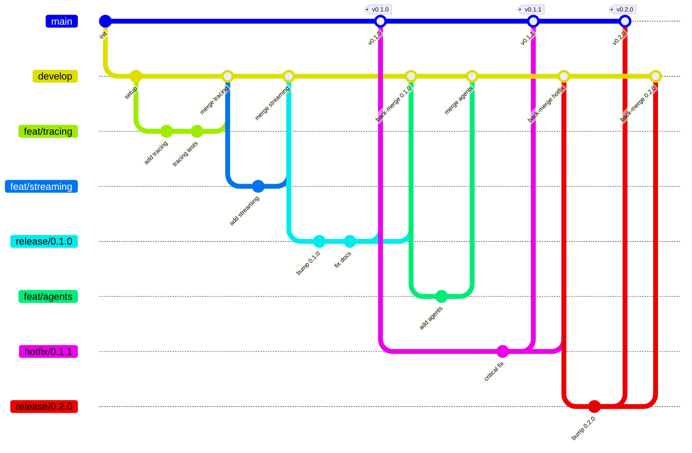

# unified-ui SDK

[](https://github.com/unified-ui/unifiedui-sdk/actions/workflows/ci-tests-and-lint.yml)
[](https://www.python.org/downloads/)
[](LICENSE)
[](https://docs.astral.sh/ruff/)

> **Python SDK for external integration with the unified-ui platform** — tracing, streaming, agents, and more.

## What is unified-ui?

**unified-ui** transforms the complexity of managing multiple AI systems into a single, cohesive experience. Organizations deploy agents across diverse platforms — Microsoft Foundry, n8n, LangGraph, Copilot, and custom solutions — resulting in fragmented user experiences, inconsistent monitoring, and operational silos.

unified-ui eliminates these challenges by providing **one interface where every agent converges**.

## What is this SDK?

The **unified-ui SDK** is a complementary Python package that provides capabilities for **external integration** with the unified-ui platform:

| Module | Description |
|--------|-------------|
| 🔍 **Tracing** | Standardized tracing objects; LangChain & LangGraph trace sniffing and forwarding |
| 📡 **Streaming** | Standardized streaming response protocol for unified-ui |
| 🤖 **Agents** | ReACT Agent class with an agent engine built on LangChain / LangGraph |
| 🧱 **Core** | Shared interfaces, base classes, and utility functions |

### How It Fits

```
┌─────────────┐     ┌──────────────────────────────────────────────┐
│  Frontend   │────▶│         Platform Service (FastAPI)           │
└─────────────┘     │  • Authentication & RBAC                     │
                    │  • Tenants, Applications, Credentials        │
                    │  • Conversations, Autonomous Agents          │
                    └──────────────────┬───────────────────────────┘
                                       │
              ┌────────────────────────┼────────────────────────┐
              ▼                        ▼                        ▼
     ┌────────────────┐    ┌────────────────┐    ┌────────────────┐
     │ Agent Service  │    │ Custom Service │    │ External App   │
     │  (Go/Gin)      │    │                │    │                │
     └────────────────┘    └────────────────┘    └────────────────┘
              │                    │                      │
              │         ┌─────────┴──────────┐           │
              │         │  unifiedui-sdk ◀───┼───────────┘
              │         │  (this package)    │
              │         └────────────────────┘
              ▼
     ┌────────────────┐
     │ AI Backends    │
     │ N8N, Foundry,  │
     │ LangGraph, ... │
     └────────────────┘
```

---

## Installation

```bash
pip install unifiedui-sdk
```

Or with [uv](https://docs.astral.sh/uv/):

```bash
uv add unifiedui-sdk
```

---

## Quick Start

```python
import unifiedui_sdk

print(unifiedui_sdk.__version__)
```

> Detailed usage guides for each module will be added to [`docs/`](docs/).

---

## Development

### Prerequisites

- Python 3.13+
- [uv](https://docs.astral.sh/uv/) (recommended)

### Setup

```bash
# Clone the repository
git clone https://github.com/unified-ui/unifiedui-sdk.git
cd unifiedui-sdk

# Install dependencies
uv sync

# Install pre-commit hooks
pre-commit install
pre-commit install --hook-type commit-msg
```

### Common Commands

| Command | Description |
|---------|-------------|
| `pytest tests/ -n auto` | Run tests in parallel |
| `pytest tests/ -n auto --cov=unifiedui_sdk --cov-fail-under=80` | Tests + coverage |
| `ruff check .` | Lint |
| `ruff format .` | Format |
| `mypy src/unifiedui_sdk/` | Type check |

> **See [TOOLING.md](TOOLING.md)** for the full tooling guide, pre-commit hooks, and CI details.

---

## Project Structure

```
unifiedui-sdk/
├── src/unifiedui_sdk/      # Main package (src layout)
│   ├── core/               # Shared interfaces & utilities
│   ├── tracing/            # Tracing objects & LangChain/LangGraph sniffing
│   ├── streaming/          # Standardized streaming responses
│   └── agents/             # ReACT Agent & agent engine
├── tests/                  # Test suite
├── docs/                   # Documentation
├── notebooks/              # Jupyter notebooks
├── pocs/                   # Proof-of-concept scripts
└── .github/                # CI workflows & Copilot instructions
```

---

## Branching Strategy

This project follows a **Git Flow** branching model optimized for open-source SDK releases with semantic versioning.



### Branch Types

| Branch | Purpose | Branches from | Merges into |
|--------|---------|---------------|-------------|
| `main` | Stable releases only — every commit is a tagged version | — | — |
| `develop` | Integration branch for the next release | `main` | `release/*` |
| `feat/<name>` | New features or enhancements | `develop` | `develop` |
| `fix/<name>` | Bug fixes (non-critical) | `develop` | `develop` |
| `release/<version>` | Release preparation (version bump, changelog, final fixes) | `develop` | `main` + `develop` |
| `hotfix/<version>` | Critical fixes on a released version | `main` | `main` + `develop` |
| `docs/<name>` | Documentation-only changes | `develop` | `develop` |
| `refactor/<name>` | Code restructuring without behavior changes | `develop` | `develop` |

### Workflow

1. **Feature development** — Create a `feat/` branch from `develop`. Open a PR back into `develop` when ready.
2. **Release preparation** — When `develop` is ready for a release, create a `release/x.y.z` branch. Bump the version, update the changelog, and fix any last-minute issues on this branch.
3. **Publishing** — Merge the release branch into `main` and tag it (`vx.y.z`). Back-merge into `develop`.
4. **Hotfixes** — For critical bugs on a released version, create a `hotfix/` branch from `main`, fix, tag, and back-merge into both `main` and `develop`.

### Rules

- **Never commit directly** to `main` or `develop` — always use PRs
- **All PRs require** passing CI (tests, lint, type check, coverage ≥ 80%)
- **Squash merge** feature branches into `develop` for a clean history
- **Merge commits** for release/hotfix branches to preserve branch topology
- **Tag format**: `v<major>.<minor>.<patch>` (e.g. `v0.1.0`)
- **Branch naming**: `<type>/<short-description>` (e.g. `feat/langchain-tracing`)

---

## Contributing

Contributions are welcome! Please read [CONTRIBUTING.md](CONTRIBUTING.md) for details on our development workflow, code standards, and how to submit pull requests.

---

## Sponsors

If you find this project useful, consider [sponsoring](SPONSORS.md) its development.

---

## License

MIT License — see [LICENSE](LICENSE) for details.
